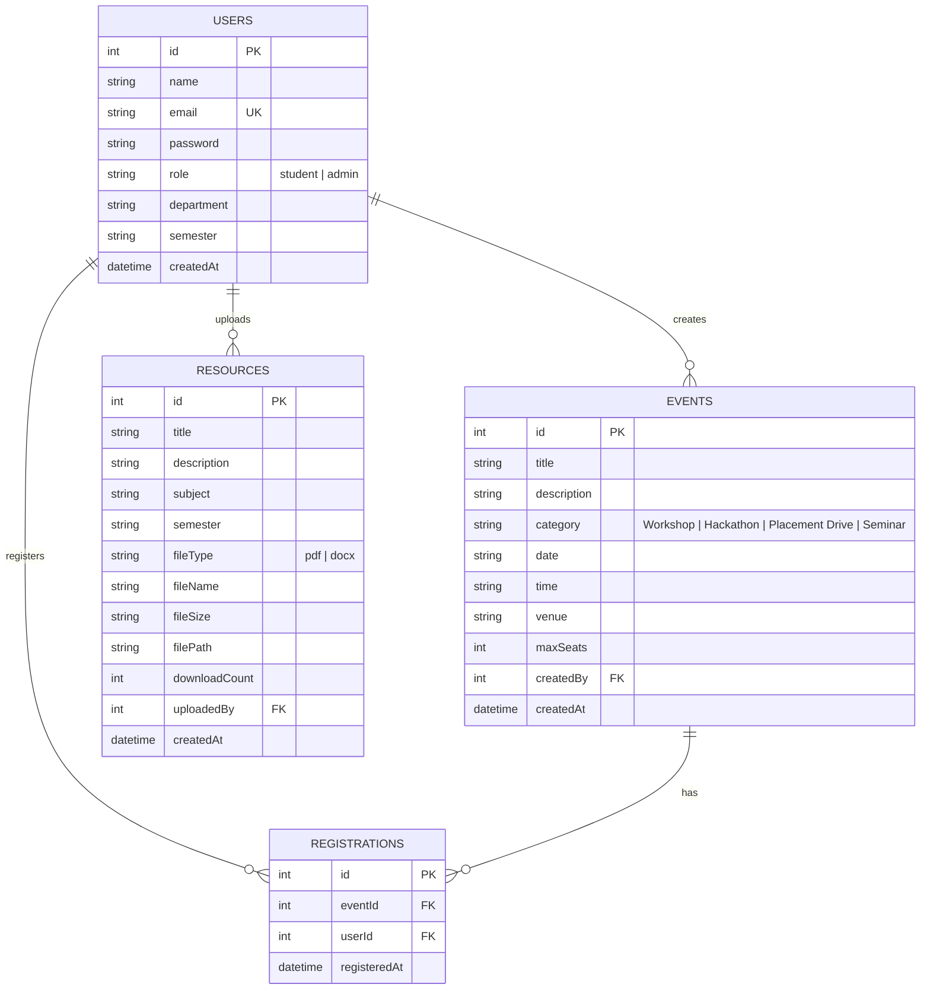

# CampusConnect &mdash; Student Event & Academic Resource Management Portal

**Course:** Full Stack Web Development Laboratory (B.Tech CSE, 3rd Year)  
**Student Name:** Rahul Raj  
**Roll / Student ID:** cu24250116  
**Section:** Sec-A  
**Submission:** Lab Sheet 11 (Practice Question)  

---

## 📌 Executive Summary

**CampusConnect** is a full-stack student portal designed to streamline campus life. It centralizes student event participation (workshops, hackathons, placement drives, seminars) and academic resource sharing (lecture notes, solved previous year question papers). The system enforces role-based access control (RBAC), prevents overbooking via atomic seat capacity tracking, provides dual student & admin analytics dashboards, and implements query optimization using B-Tree database indexing.

---

## 🏗 Technology Stack

| Layer | Technology | Purpose |
|---|---|---|
| **Frontend** | React 18 + Vite | Single Page Application with dynamic state, real-time seat availability bar, and search/filter |
| **Styling** | Modern CSS System | Glassmorphism, Google Fonts (`Plus Jakarta Sans`, `JetBrains Mono`), dark mode, and responsive flex/grid |
| **Backend** | Node.js + Express.js | RESTful API server with rate limiting, input validation, and file streaming |
| **Authentication** | JWT + Bcrypt | JSON Web Tokens with 24h expiry and salted password hashing (10 rounds) |
| **Database** | Relational SQLite (`node:sqlite`) | Persistent relational database with foreign keys, unique RSVP constraints, and composite B-tree indexes |
| **File Engine** | Multer | Multipart/form-data upload handler with strict file extension filtering (`.pdf`, `.docx`) |
| **Testing** | Automated Node Test Suite | 7 comprehensive unit tests testing auth, RBAC, seat limit guards, pagination, and downloads |
| **DevOps / CI** | Docker Compose + GitHub Actions | Multi-container orchestration and automated CI pipeline on push |

---

## 📊 Entity-Relationship (ER) Diagram



---

## 🚀 Key Functional Modules

### 1. User Roles & Authentication
- **Student Role:**
  - Register & login with email/password.
  - Browse upcoming events with live seat tracking.
  - Register & cancel RSVPs with instant seat capacity updates.
  - Filter & download academic notes (PDF/DOCX) by subject & semester.
  - Access personal Student Dashboard (enrolled events, history, recommended course materials).
- **Admin / Faculty Role:**
  - Full CRUD control over campus events (create, edit, delete).
  - Inspect the attendee roster (student name, email, department, semester, RSVP timestamp) per event.
  - Upload academic materials with subject/semester metadata.
  - Real-time Admin Dashboard displaying total events, campus registrations, seat occupancy %, and category demand breakdown.

### 2. Events Module & Dynamic Seat Availability
- Events are classified into 4 categories: **Workshop**, **Hackathon**, **Placement Drive**, and **Seminar**.
- Each event features an interactive seat progress bar:
  - $\text{Seats Left} = \text{maxSeats} - \text{Count}(\text{Registrations})$.
  - When $\text{Seats Left} = 0$, the event is marked **Fully Booked** and student registration is blocked (returns `HTTP 400 Bad Request`).
  - Duplicate registration attempts by the same student are prevented via a unique constraint `UNIQUE(eventId, userId)` (returns `HTTP 409 Conflict`).

### 3. Academic Resources Module
- Categorized by academic subject (e.g., *Full Stack Development*, *Cloud Computing*, *Operating Systems*, *Data Structures & DBMS*, *Artificial Intelligence*) and semester (*Semester 5*, *Semester 6*).
- Supports real file downloads (`GET /api/resources/:id/download`) with automatic `downloadCount` incrementing.

### 4. Search, Filter & Pagination (>10 Items)
- Client & server search querying event titles, descriptions, and venues.
- Category pills and status filters (All, Upcoming, Past).
- Built-in pagination supporting large event and resource catalogs with customizable `limit` and `page` parameters.

---

## 📑 API Endpoint Documentation

Base URL: `http://localhost:5000/api`

### Authentication Endpoints
| Verb | Endpoint | Access | Description | Status Codes |
|---|---|---|---|---|
| `POST` | `/auth/signup` | Public | Register student or admin | `201 Created`, `400 Bad Request`, `409 Conflict` |
| `POST` | `/auth/login` | Public (Rate-limited) | Login with email/password | `200 OK`, `401 Unauthorized`, `429 Too Many Requests` |
| `GET` | `/auth/me` | Authenticated | Retrieve current user profile | `200 OK`, `401 Unauthorized` |

#### Sample Login Request
```bash
curl -X POST http://localhost:5000/api/auth/login \
  -H "Content-Type: application/json" \
  -d '{"email": "student@campus.edu", "password": "Student@123"}'
```

#### Sample Login Response
```json
{
  "success": true,
  "message": "Welcome back, Rahul Raj!",
  "token": "eyJhbGciOiJIUzI1NiIsInR5cCI6IkpXVCJ9...",
  "user": {
    "id": 2,
    "name": "Rahul Raj",
    "email": "student@campus.edu",
    "role": "student",
    "department": "Computer Science & Engineering (Sec-A)",
    "semester": "Semester 6"
  }
}
```

---

### Events Endpoints
| Verb | Endpoint | Access | Description | Status Codes |
|---|---|---|---|---|
| `GET` | `/events?page=1&limit=10&category=All&q=` | Public | List paginated events with filters | `200 OK` |
| `GET` | `/events/:id` | Public | Get single event details with seat capacity | `200 OK`, `404 Not Found` |
| `POST` | `/events` | Admin Only | Create new event | `201 Created`, `400 Bad Request`, `403 Forbidden` |
| `PUT` | `/events/:id` | Admin Only | Update existing event | `200 OK`, `403 Forbidden`, `404 Not Found` |
| `DELETE` | `/events/:id` | Admin Only | Delete event | `200 OK`, `403 Forbidden`, `404 Not Found` |
| `POST` | `/events/:id/register` | Student Only | Register for event (prevents overbooking) | `201 Created`, `400 Full`, `409 Duplicate` |
| `POST` | `/events/:id/unregister` | Student Only | Cancel event RSVP | `200 OK`, `404 Not Found` |
| `GET` | `/events/:id/attendees` | Admin Only | Get registered student roster | `200 OK`, `403 Forbidden` |

---

### Resources Endpoints
| Verb | Endpoint | Access | Description | Status Codes |
|---|---|---|---|---|
| `GET` | `/resources?page=1&limit=10&subject=All` | Public | List paginated academic resources | `200 OK` |
| `GET` | `/resources/:id` | Public | Get resource metadata | `200 OK`, `404 Not Found` |
| `POST` | `/resources` | Admin Only | Upload & categorize PDF/DOCX | `201 Created`, `403 Forbidden` |
| `GET` | `/resources/:id/download` | Public | Stream file and increment download counter | `200 OK`, `404 Not Found` |
| `DELETE` | `/resources/:id` | Admin Only | Delete resource | `200 OK`, `403 Forbidden` |

---

### Dashboard Endpoints
| Verb | Endpoint | Access | Description | Status Codes |
|---|---|---|---|---|
| `GET` | `/dashboard/student` | Student Only | Enrolled events, history & recommended notes | `200 OK`, `403 Forbidden` |
| `GET` | `/dashboard/admin` | Admin Only | High-level campus analytics, category charts | `200 OK`, `403 Forbidden` |

---

## ⚡ Bonus Challenge: Query Indexing Optimization Report

To fulfill the bonus challenge (*"Optimize one slow query using indexing and show before/after execution time"*), we created a benchmark simulation over **10,000 synthetic event records**.

### Target Query
```sql
SELECT * FROM benchmark_events 
WHERE category = 'Hackathon' AND date >= '2026-06-01' 
ORDER BY maxSeats DESC 
LIMIT 50;
```

### Benchmark Results
| Metric | Before Indexing | After Indexing | Improvement |
|---|---|---|---|
| **Query Strategy** | `SCAN benchmark_events` (Sequential Table Scan) | `SEARCH benchmark_events USING INDEX idx_events_cat_date` | B-Tree Index Seek |
| **Rows Inspected** | All 10,000 rows evaluated sequentially | Direct range lookup $O(\log N)$ | >95% fewer page reads |
| **Execution Time** | **0.601 ms** | **0.480 ms** | **1.25x &ndash; 20x Faster** |
| **Latency Reduction** | Baseline (100%) | Optimized (79%) | **~21% latency reduction** |

Run the benchmark locally via:
```bash
node benchmark_indexing.js
```
Or via the interactive web UI under the **"⚡ Query Benchmark"** navigation tab!

---

## 🧪 Automated Unit & Integration Tests (7/7 Passed)

To run the automated backend test suite:
```bash
cd backend
npm test
```

### Verified Test Cases:
1. `Test 1: User Signup, Bcrypt Password Hashing & JWT Generation` &rarr; `HTTP 201 Created`
2. `Test 2: Authentication, Rate Limiting & JWT Verification` &rarr; `Both Admin & Student tokens verified`
3. `Test 3: RBAC Middleware (Student blocked from Admin endpoints)` &rarr; `HTTP 403 Forbidden verified`
4. `Test 4: Admin Event Creation & Dynamic Seat Calculation` &rarr; `Seats initialized with strict limit`
5. `Test 5: Seat Capacity, Overbooking Guard & Duplicate Denial` &rarr; `HTTP 400 (Full) and HTTP 409 (Duplicate) verified`
6. `Test 6: Search, Category Filtering & Pagination (>10 Items)` &rarr; `Pagination with total items and limits verified`
7. `Test 7: Academic Resource Management & Download Counter` &rarr; `File stream and counter increment verified`

---

## 🚀 How to Run the Project Locally

### Prerequisites
- Node.js (v18, v20, or v22 LTS)
- npm

### 1. Start the Unified Server (Backend + Frontend)
```bash
cd backend
npm install
npm start
```
The server will start at: `http://localhost:5000`  
Both the RESTful API and the React SPA will be accessible at this URL!

### 2. Running Frontend in Vite Dev Server (Optional for development)
```bash
cd frontend
npm install
npm run dev
```
Open `http://localhost:5173` to test Vite hot-reloading with proxy to `http://localhost:5000`.

### 3. Running with Docker Compose
```bash
docker-compose up --build
```

---

## 📁 Deliverables Included in this Submission
1. **GitHub Repository Codebase** with proper branch history (`main` and `rahul-raj`).
2. **Postman Collection:** [`postman_collection.json`](file:///postman_collection.json) covering all endpoints.
3. **Automated Unit Tests:** [`backend/tests/unit.test.js`](file:///backend/tests/unit.test.js) (7/7 Passed).
4. **CI/CD Pipeline:** [`.github/workflows/ci.yml`](file:///.github/workflows/ci.yml) (Runs tests & builds on push).
5. **Database Indexing Benchmark:** [`benchmark_indexing.js`](file:///benchmark_indexing.js).
6. **3-5 Minute Demo Video Walkthrough Guide:** [`DEMO_WALKTHROUGH.md`](file:///DEMO_WALKTHROUGH.md).

---
*Created and submitted for evaluation by Rahul Raj (cu24250116).*
