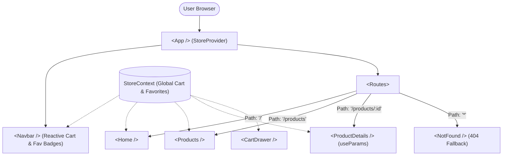

# Lab 4 — React Routing and State Management

**Student Name:** Rahul Raj  
**Course:** Full Stack Web Development Lab  
**Aim:** Build a multi-page single-page application (SPA).

---

## 🎯 Syllabus Tasks Addressed

1. **Create a 3-page app (Home, Products, Product Details) using `react-router-dom`**:
   - `Home` (`/`): High-conversion developer workstation showcase.
   - `Products` (`/products`): Full catalog with category chips, sorting, and search filtering.
   - `ProductDetails` (`/products/:id`): Dynamic detail view driven by route parameters.
2. **Pass data between routes using route params and/or Context API**:
   - `useParams()` hook extracts `:id` to look up product metadata dynamically.
   - `useSearchParams()` hook coordinates query parameters across navigation (`?cat=Computing`).
3. **Implement a global state using Context API**:
   - `StoreContext` provides application-wide access to:
     - `cart`: items, quantities, subtotal, add, remove, and clear operations.
     - `favorites`: bookmarked items across routes with dynamic heart badges.
     - `totalCartItems`: live reactive counter visible in the navigation header on every route.
4. **Add a loading state and a 404 Not Found page**:
   - `<LoadingSkeleton />`: Animated shimmer loading state when loading product details.
   - `<NotFound />`: Custom 404 page for unmatched routes with active registered routes list and navigation buttons.

---

## 🗺️ SPA Routing & State Flow Architecture



---

## 🚀 How to Run

```bash
# Install dependencies
npm install

# Start local development server
npm run dev

# Build production bundle
npm run build
```
