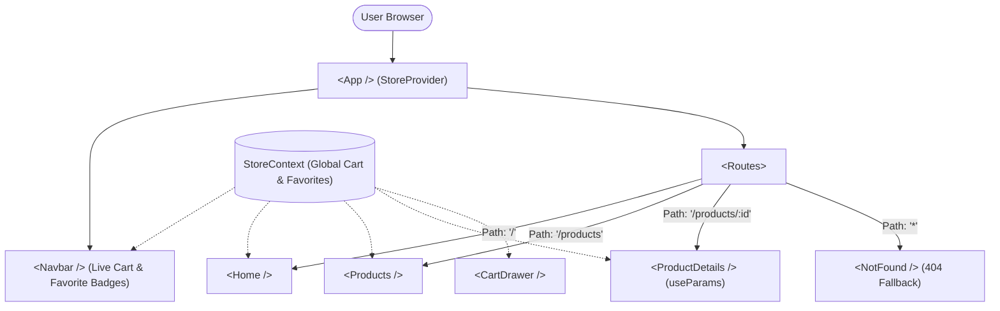
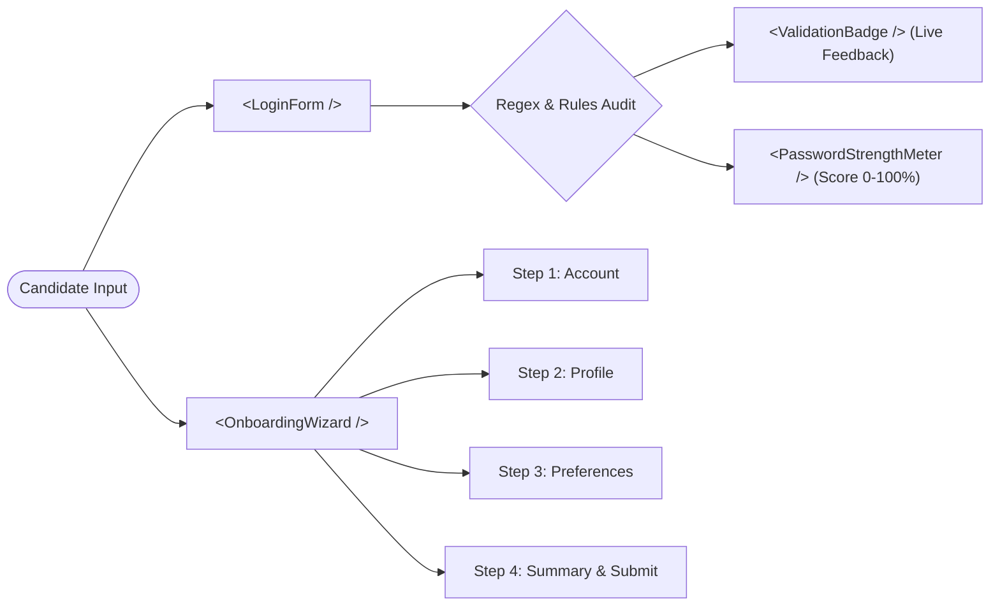
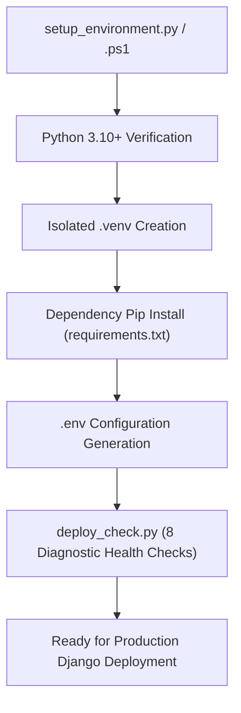

# Full Stack Web Development Lab Submissions (Labs 1 &ndash; 6)

**Student Name:** Rahul Raj  
**Roll / Student ID:** cu24250116  
**Course:** Full Stack Web Development Laboratory (Sec-A)  
**Submissions Included:** Lab Sheet 01, Lab Sheet 02, Lab Sheet 03, Lab Sheet 04, Lab Sheet 05, Lab Sheet 06  

---

## 📁 Repository Directory Structure

```text
Rahul Raj/
├── index.html                                 # Central Evaluation & Showcase Hub (Labs 1-6)
├── README.md                                  # Complete Technical Guide & Documentation
│
├── Lab Sheet 1/                               # LAB SHEET 01: Core Web Structures Using Semantic HTML
│   ├── task1_resume/ (index.html, style.css)  # Task 1.1: Semantic HTML5 Resume Page (A11y, WCAG 2.1)
│   ├── task2_nested_nav/ (index.html, style.css) # Task 1.2: Nested Navigation Menu with Absolute URLs
│   └── task3_catalog/ (index.html, style.css) # Task 1.3: Itemized Web Catalog (<dl>, <dt>, <dd>)
│
├── Lab Sheet 2/                               # LAB SHEET 02: Dynamic Interface Styling & Interactivity
│   ├── task1_dark_mode/ (index.html, style.css, script.js) # Task 2.1: CSS Variables Dark Mode
│   ├── task2_photo_grid/ (index.html, style.css)           # Task 2.2: Flexbox Photo Grid (Fluid Wrapping)
│   └── task3_todo_app/ (index.html, style.css, script.js)  # Task 2.3: Validation Flags Todo App
│
├── Lab Sheet 3/                               # LAB SHEET 03: Introduction to React.js
│   ├── package.json, vite.config.js           # Vite + React 18 configuration
│   ├── dist/                                  # Production built preview bundle
│   └── src/
│       ├── App.jsx                            # State & Effect persistence engine
│       ├── components/
│       │   ├── AddTaskForm.jsx                # Input form with operational validation flags
│       │   ├── TaskList.jsx                   # Container mapping to child items
│       │   ├── TaskItem.jsx                   # Single task element with status & actions
│       │   ├── FilterTabs.jsx                 # Filter tab controls & count indicators
│       │   ├── TaskMetrics.jsx                # Analytics & completion rate calculator
│       │   └── ComponentTree.jsx              # Deliverable: Component Tree Diagram UI
│       └── README.md                          # Architecture specs & Component Tree Diagram
│
├── Lab Sheet 4/                               # LAB SHEET 04: React Routing & State Management
│   ├── package.json, vite.config.js           # Vite + React + react-router-dom
│   ├── dist/                                  # Production built preview bundle
│   └── src/
│       ├── App.jsx                            # react-router-dom route declarations
│       ├── context/
│       │   └── StoreContext.jsx               # Context API Global State (Cart & Favorites)
│       ├── data/
│       │   └── products.js                    # Comprehensive developer hardware catalog
│       ├── pages/
│       │   ├── Home.jsx                       # 1. Landing Page
│       │   ├── Products.jsx                   # 2. Products Catalog with filters & search
│       │   ├── ProductDetails.jsx             # 3. Dynamic Route (:id params)
│       │   └── NotFound.jsx                   # 4. Custom 404 Not Found Page
│       └── components/
│           ├── Navbar.jsx                     # Reactive badges for Cart & Favorites
│           ├── ProductCard.jsx                # Reusable catalog card
│           ├── CartDrawer.jsx                 # Global Cart Drawer modal
│           └── LoadingSkeleton.jsx            # Deliverable: Loading state simulator
│
├── Lab Sheet 5/                               # LAB SHEET 05: Form Validation & Controlled Inputs in React
│   ├── package.json, vite.config.js           # Vite + React 18 configuration
│   ├── dist/                                  # Production built preview bundle
│   ├── README.md                              # Form validation & entropy documentation
│   └── src/
│       ├── App.jsx                            # Main container with tab switcher
│       └── components/
│           ├── LoginForm.jsx                  # Task 5.1: Real-time controlled inputs & regex validation
│           ├── PasswordStrengthMeter.jsx      # Task 5.2: Shannon entropy calculator & progress bar
│           ├── ValidationBadge.jsx            # Live dynamic requirement checklist badges
│           ├── OnboardingWizard.jsx           # Task 5.3: 4-step registration wizard
│           └── steps/
│               ├── Step1Account.jsx           # Step 1: Account credentials
│               ├── Step2Profile.jsx           # Step 2: Personal profile & avatar
│               ├── Step3Preferences.jsx       # Step 3: Notification & UI preferences
│               └── Step4Summary.jsx           # Step 4: Final verification overview
│
└── Lab Sheet 6/                               # LAB SHEET 06: Backend Infrastructure & Shell Scripting
    ├── requirements.txt                       # Django, DRF, python-dotenv, flake8, black
    ├── setup_environment.py                   # Task 6.1: Automated Python environment provisioner
    ├── setup_environment.ps1                  # Task 6.1: Automated PowerShell provisioner
    ├── deploy_check.py                        # Task 6.3: Automated pre-flight deployment diagnostic (8/8)
    ├── README.md                              # Architecture specs & execution guide
    ├── .vscode/                               # Task 6.2: IDE PEP8 & Quality Guardrails
    │   ├── settings.json                      # Auto black format on save, flake8 linting, line length 88
    │   ├── keybindings.json                   # Shortcuts for diagnostics, formatting, runserver
    │   └── python.code-snippets               # Django & DRF reusable templates
    └── django_project/                        # Minimal production Django backend
        ├── manage.py                          # Administrative CLI entrypoint
        ├── .env                               # Active environment variables
        ├── .env.example                       # Environment template
        └── core/
            ├── __init__.py
            ├── settings.py                    # Django core settings with dotenv integration
            ├── urls.py                        # Route definitions with /api/health/ endpoint
            ├── wsgi.py                        # WSGI server callable
            └── asgi.py                        # ASGI server callable
```

---

## 🌳 Lab 3: Component Tree Diagram

```mermaid
graph TD
    App["&lt;App /&gt; (useState, useEffect, localStorage)"]
    App --> AddTaskForm["&lt;AddTaskForm /&gt; (Input &amp; Validation Flags)"]
    App --> FilterTabs["&lt;FilterTabs /&gt; (Filter State Callbacks)"]
    App --> TaskList["&lt;TaskList /&gt; (Props Delegation)"]
    App --> TaskMetrics["&lt;TaskMetrics /&gt; (Computed Stats)"]
    TaskList --> TaskItem["&lt;TaskItem /&gt; (Dynamic Item Row xN)"]

    AddTaskForm -.->|onAddTask(newTodo)| App
    FilterTabs -.->|onFilterChange(filter)| App
    TaskItem -.->|onToggle(id) / onDelete(id)| TaskList
    TaskList -.->|onToggleTask / onDeleteTask| App
```

---

## 🗺️ Lab 4: SPA Routing & State Flow Architecture



---

## 🔐 Lab 5: Form Validation & Registration Wizard



---

## ⚙️ Lab 6: Backend Infrastructure & Pre-Flight Diagnostics



---

## 🚀 How to Run & Verify

### Viewing the Central Portal:
Open `Rahul Raj/index.html` in your browser to launch and test all 6 lab sheets!

### Running Lab 3 (React.js):
```bash
cd "Rahul Raj/Lab Sheet 3"
npm run dev     # or preview dist/ with: npm run preview
```

### Running Lab 4 (React Router SPA):
```bash
cd "Rahul Raj/Lab Sheet 4"
npm run dev     # or preview dist/ with: npm run preview
```

### Running Lab 5 (React Form Validation):
```bash
cd "Rahul Raj/Lab Sheet 5"
npm run dev     # or preview dist/ with: npm run preview
```

### Running Lab 6 (Backend Environment & Diagnostics):
```bash
cd "Rahul Raj/Lab Sheet 6"
python setup_environment.py       # Provision environment
python deploy_check.py            # Run 8-point deployment health diagnostics
python django_project/manage.py runserver  # Launch Django API
```
Navigate to `http://127.0.0.1:8000/api/health/` to view JSON health status.
